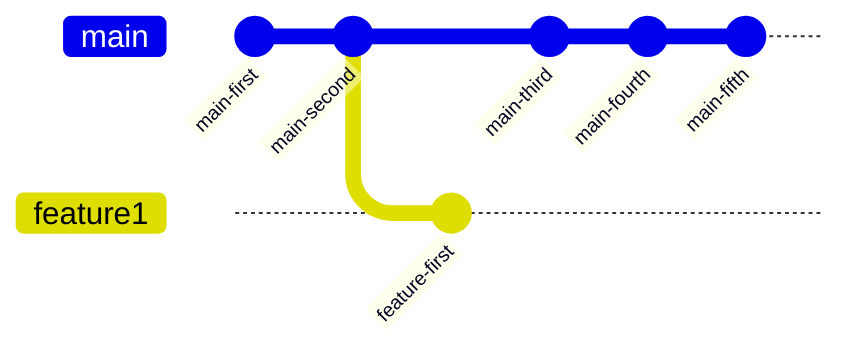
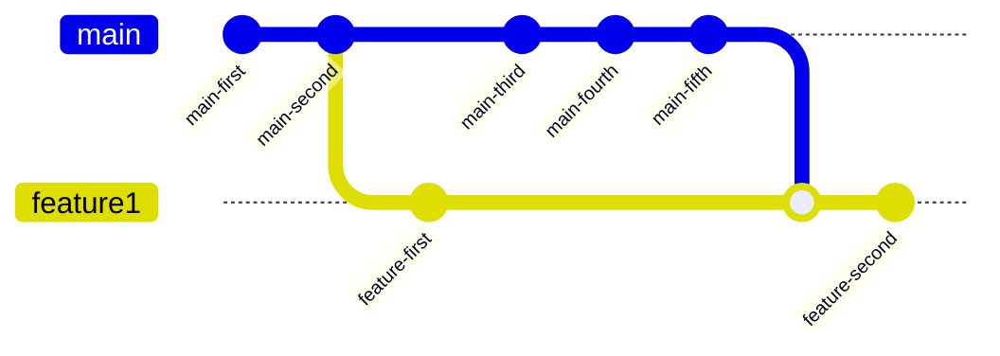
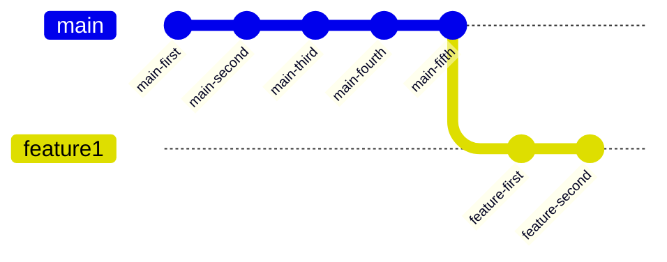

# Introduction
I will start by quoting the official [Git Book's closing statement on "Rebase vs. Merge"](https://git-scm.com/book/en/v2/Git-Branching-Rebasing#_rebase_vs_merge):

> You can get the best of both worlds: rebase local changes before pushing to clean up your work, but never rebase anything that you’ve pushed somewhere.

This repository aims to show how this is not a discussion about personal preference. It's
about respecting your teammates and the review process. This is not an attack on anyones
personal views or opinions. I am simply advocating for the process with the least friction
when operating **AS A TEAM**.

## Repository Contents
This repository has a bunch of garbage in it. It's mostly for the examples in the PRs, but it's
worth explaining. There are over 5000 scripts in this repository. A lot of them are the same, but
there are two that are important: `137.py` and `382.py`. I picked those numbers randomly so they
would show up deeper in the list of lexographically sorted names in PRs. They are modified
in the subsequent PRs. All of the scripts just print stuff, though.

## The Situation
This repository is an example of why using `rebase` instead of `merge` is bad when trying to
incorporate upstream changes into your branch specifically when operating in a team.

Some assumptions:
1. Your `main` branch enforces a rebase strategy for Pull Requests.
2. You can do whatever you want in your branch prior to opening it for collaboration.
3. It is the Pull Request author's responsibility to make reviewing the PR as straightforward as possible.
4. We are specifically talking about using rebase for incorporating changes from `main` after already pushing commits.
  a. More specifically, we are more concerned with the force push aspect, which rewrites history in a destructive manner.

Generally, we are talking about a situation where a branch diverges from `main`. This generally looks like this:



In this case, we want to update the `feature1` branch to ensure tests pass and
that our code does not conflict with the updated version of `main`.

## Update Using Merge Commits
To update your branch using a merge commit, it generally takes one command, but you
also likely want to update your local copy of `main` first as well. So, it looks like
this normally.

```sh
git switch main
git pull
git switch feature1
git merge main

# Continue committing like normal...
touch something
git add something
git commit -m "changed something"

# Now push like normal
git push

# Note, you could do this assuming you are starting with feature1 checked out,
# but it's normally helpful to keep your local copy of main up to date as well.
git fetch origin/main
git merge origin/main
```

In a graph form, this process looks like:



## Update Using Rebase
Another approach is to (ab)use rebase to accomplish a similar task. This also likely
involves updating your `main` branch, and the commands are largely similar except
that you need an extra argument to `git push` because git tries to prevent you from
destroying history.

```sh
git switch main
git pull
git switch feature1
git rebase main

# Continue committing like normal...
touch something
git add something
git commit -m "changed something"

# Now you **MUST** force push due to the destruction of history
git push --force
```

At a glance, this accomplishes a similar task, but cruicially, it does something very
different. Instead of make a new "merge commit" which documents what exactly happened,
`git` will take all your commits since the divergence, and "replay" them over the new
`HEAD` of `main`. So, if we look at the history in graph form after this, we would see
this:



## The Pro's and Con's

This *looks* nice, but it's very important to understand a few things:

1. After doing this, all commit hashes in your branch of changed.
2. Because you have completely rewritten the history, you must force push your branch back to the remote.
3. Anyone collaborating with you will have to manually resolve this discontinuity to fix their local copies.
4. There is no guarantee that the new commit hashes are the same as the old commit hashes.

The third and fourth point are the biggest problems. When you are collaborating with others,
whether that is requesting a review or both having the same branch checked out, maintaining
a clear and consistent change history is important for cooperation.

As a reviewer, it is impossible for me to understand what happened to the old history unless I do the
following:

1. I must know the old `HEAD` commit hash of your branch (GitHub will tell you this).
2. I must checkout your branch locally (or repair my broken local copy after you destroyed the history).
3. I must run `git range-diff main OLD_HEAD NEW_HEAD`.

This is teadious, and error prone. Additionally, it cannot be represented in GitHub's UI, and therefore is
not well integrated into the review process.

In GitHub, clicking the `Compare` button next to a force push line in the history shows all changes which
include changes from your branch and from the changes incorporated from `main`. On busy repositories, this
is often thousands of lines.

Given a situation where a reviewer has already left a review on a PR, and the PR author decides to rebase
their branch onto `main`, the reviewer has three choices:

1. Ignore the updates after review, and blindly trust the author didn't make a mistake.
2. Go through extra effort to get the branch locally and dissect the changes with `git range-diff`.
3. Re-review the entire branch to verify no other chnages were made.

**IN CONTRAST**, using a merge commit does not take any extra commands. It does not make any extra mess
in the commit history, and it will clearly document in a reliable and technically guaranteed manner what
was changed in the commit.

**The most important part is that using a merge commit requires no extra effort for either the reviewer
or the author. Not using a merge commit is simply rude in a collaborative environment.**
